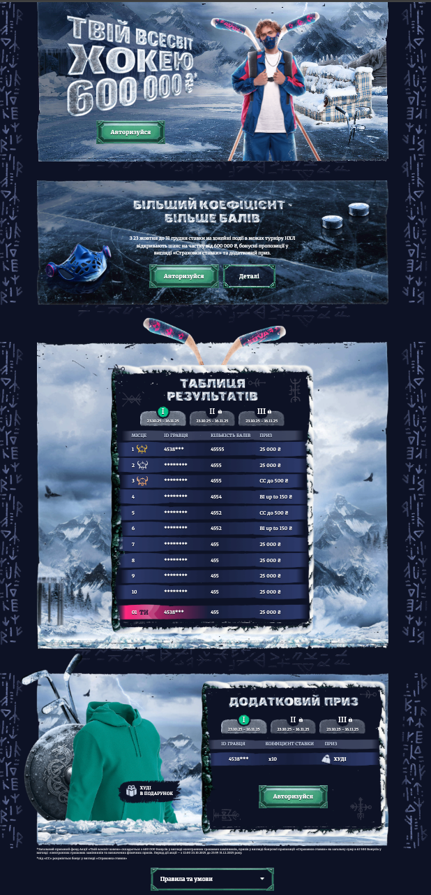

**************  API ROUTES ****************

## 🧍 USERS API

### **GET** `/favuser/:id`
**Response:**
```json
{
  "points": [number],
  "points_started": [number],
  "userid": number,
  "date": "Date"
}
```

---

### **GET** `/users`
**Response:**
```json
[
  {
    "userid": number,
    "points": number,
    "date": "Date"
  }
]
```

---

### **GET** `/active`
**Response:**
```json
[
  {
    "userid": number,
    "pointsGained": number,
    "date": "Date"
  }
]
```

---

### **GET** `/users/:week`
**Response:**
```json
[
  {
    "userid": number,
    "points": number,
    "date": "Date",
    "winner": boolean,
    "coefIn?": number //only for winner = true
  }
]
```

---

### **POST** `/user`
**Body:**
```json
{
  "userid": number
}
```  
**Response:**
```json
{
  "success": boolean
}
```

---

## 🌐 TRANSLATES API

### **GET** `/new-translates`
**Response:**
```json
[
  {
    "_id": "ObjectId",
    "trKey": "string",
    "locales": {
      "en": "string",
      "ua/hr/ro": "string"
    }
  }
]
```

---

### **GET** `/new-translates/:locale`
**Response:**
```json
{
  "[key]": "string"
}
```

---

### **POST** `/new-translates`
**Body:**
```json
{
  "key": "string",
  "locales": {
    "[key]": "string"
  }
}
```  
**Response:**
```json
{
  "success": "string"
}
```

---

### **POST** `/new-translate/delete`
**Body:**
```json
{
  "key": "string"
}
```  
**Response:**
```json
{}
```

---

### **GET** `/new-translates/migrate`
**Response:**
```json
{}
```


# Опис функцій та ініціалізації

## Функції

- **getActiveWeek()**  
  Обчислює номер поточного тижня акції, враховуючи дату початку і тривалість.

- **request()**  
  Універсальна функція для виклику API з обробкою помилок.

- **hideLoader()**  
  Приховує лоадер.

- **loadTranslations()**  
  Завантажує переклади та запускає функцію `translate()`.

- **participate()** 
    відповідає за реєстрацію юзера в акції, запускається при кліку на кнопку "Взяти участь"
    прик запуску вішає лоадер на кнопку, після успішної реєстрації запускає checkUserAuth()
    для оновлення стану ui сторінки

- **checkUserAuth()**  
  Перевіряє, чи авторизований користувач, і показує відповідні елементи та ховає глобальний лоадер.
  Глобальний лоадер по дефолту увімкнений, і вимикається тільки після першого запуску checkUserAuth()

- **reportError()**  
  Відправляє інформацію про помилки на бекенд.

- **translate()**  
  Перекладає всі елементи з атрибутом `data-translate`.

- **renderUsers()**  
  Завантажує список користувачів і передає їх у `populateUsersTable()`.

- **populateUsersTable()**  
  Рендерить таблицю користувачів і підсвічує поточного.

- **displayUser()**  
  Виводить одного користувача в таблиці з відповідним форматуванням.

- **maskUserId()**  
  Маскує ID користувача для конфіденційності.

- **getPrizeTranslationKey()**  
  Визначає ключ для перекладу призу на основі місця.

- **translateKey()**  
  Повертає переклад або ключ, якщо переклад відсутній.

- **refreshLocalizedClass()**  
  Додає відповідний клас локалі до root-елемента.

- **init()**  
  Ініціалізація логіки сторінки

- **quickCheckAndRender()**  
  Запускається після перевірки наявності `userId`.  
  В середині цієї функції запускаються всі функції, що відповідають за поведінку сторінки.  
  Це стартова точка після відпрацювання дефолтної логіки, яка є на всіх промо.

## Правильна ініціалізація сторінки --> loadTranslations().then(init)


1. Завантажуємо переклади за допомогою функції `loadTranslations()`.
2. Після цього викликаємо функцію `init()`, в якій:
    - Визначається `userId`.
    - Запускається функція `quickCheckAndRender()`.
    - Перше, що потрібно викликати всередині `quickCheckAndRender()`, — це `checkUserAuth()`.
    - Після цього викликаємо всі інші функції в необхідному порядку всередині quickCheckAndRender().


## Важливі змінні

- **locale**
    відповідає за визначення локалі на сторінці
    (по дефолту ставимо en щоб переклади не зламались на випадок якщо з логікою визначення локалі щось піде не так)

- **ukLeng**, **enLeng**, **roLeng**, **hrLeng**  
  Відповідають за детекцію вірної локалі сніпетів на проді.  
  На їх основі ми присвоюємо значення для змінної `locale`, яка відповідає за мову на сторінці.
  принцип роботи - в сніпеті для кожної локалі в розмітку кладемо інпут з відповідною id
  потім цю id отримуємо в js і на основі її вже присвоюємо значення для locale

- **loaderBtn**  
  Відповідає за стан лоадеру кнопок (значення `true`/`false`).

- **debug**  
  Відповідає за включення або виключення потрібного функціоналу під час розробки (значення `true`/`false`).

- **i18nData**  
  Масив з перекладами сторінки.

- **userId**  
  ID користувача.

- **apiURL**
    адреса API нашої акції - "https://fav-prom.com/your-endpoint"

- **promoStartDate**
    дата старту нашої акції, потрібна для коректного вираховування періодів акції(тижнів)

- **weekDuration**
    кількість днів в одному періоді акції

- **translateState**
    відповідає за заміну перекладів у елементах з відповідними дата атрибутами
    має значення true/false
    true - переклад спрацює
    false - не спрацює
    потрібна на випадок якщо треба працювати з фронтом але актуального контенту в адмінці ще немає

